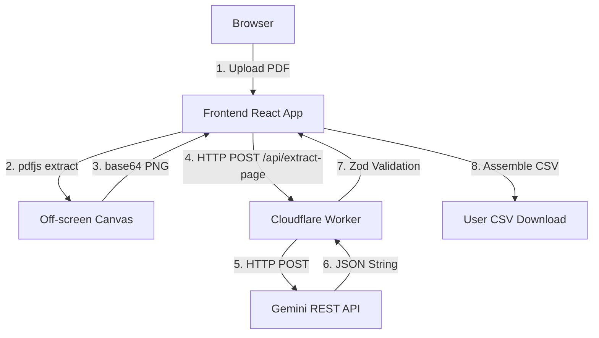

# 01 - System Architecture

This document describes the high-level architecture of the MBR Extractor application. This project was rewritten from Python to a pure TypeScript stack optimized for Cloudflare.

## System Overview

The application extracts structured data from scanned Master Batch Record (MBR) PDFs. It consists of two standalone parts:

1. **Frontend**: React + Vite SPA hosted on Cloudflare Pages.
2. **Backend**: Hono API hosted on Cloudflare Workers.

### Component Diagram

## Key Architectural Decisions

### 1. Client-Side PDF Processing
**Why:** Cloudflare Workers limits request body size (100MB max) and CPU time (10ms free, 30s paid). Server-side PDF rendering of a 100-page scanned document would hit maximum limits.
**How:** The React frontend uses `pdfjs-dist` to render pages to an off-screen HTML `<canvas>`, and converts them to base64 PNGs.

### 2. Parallel Page-by-Page Orchestration
**Why:** Sending a 100-page document in a single request would time out and fail rate limits, while strictly sequential processing is too slow.
**How:** The frontend orchestrates the extraction process concurrently using a limited worker pool (e.g., 3 pages at a time). Each request to the backend contains exactly one base64 image. This keeps payload sizes small (200-500KB) and API request durations well within limits while maximizing extraction throughput.

### 3. Stateless Backend / No Database
**Why:** This is an MVP. Using Cloudflare D1 or Supabase adds unnecessary complexity for ephemeral data.
**How:** The backend worker holds zero state. It acts strictly as a proxy and validation layer. All intermediate state (failed pages, extracted rows) lives in the browser's memory. When extraction finishes, the CSV is built client-side.

### 4. Direct REST API calls to Gemini
**Why:** The official Google Gen AI SDK can sometimes have compatibility issues with Cloudflare Workers' Edge runtime.
**How:** The worker uses the native `fetch` API to make standard direct HTTP POST calls to the Gemini REST endpoint (`https://generativelanguage.googleapis.com/v1beta/models/...`).

### 5. Type Sharing
Frontend and Backend share identical structural types (see `frontend/src/types.ts` and `worker/src/types.ts`), keeping the contract strict without requiring a monorepo tooling overhead like Turborepo.
